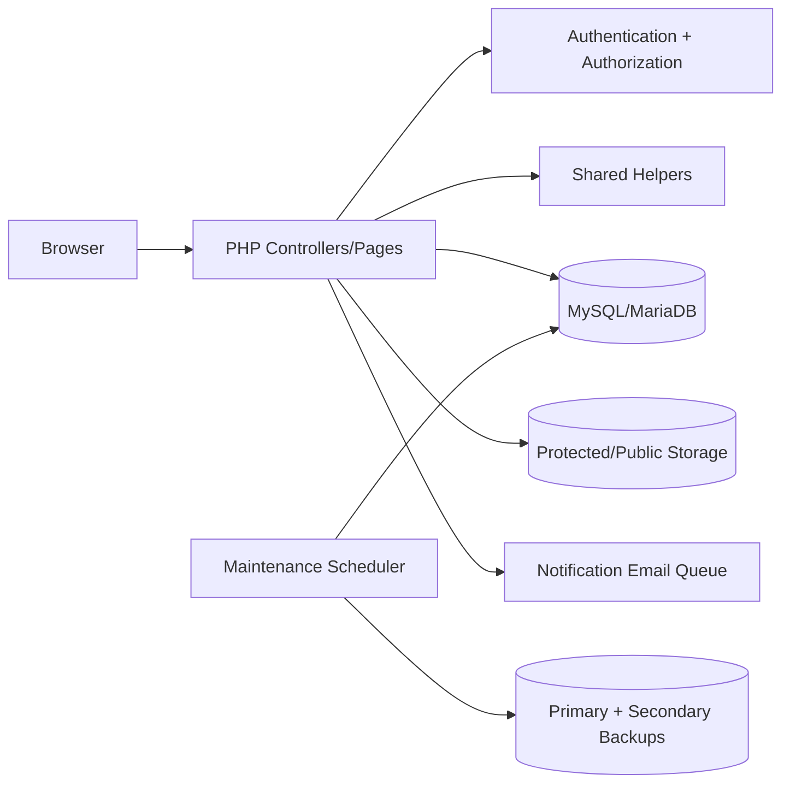
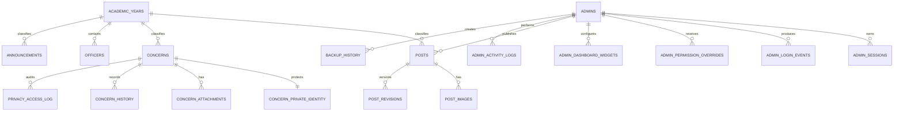
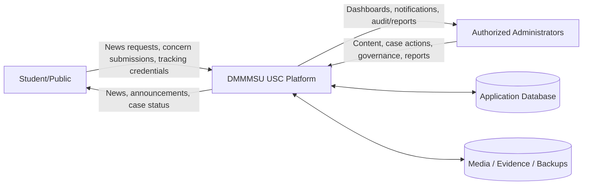
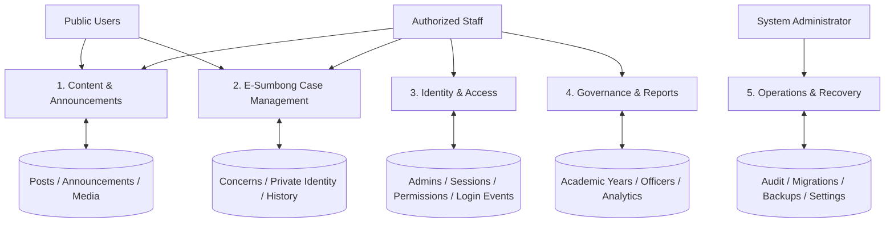

# DMMMSU USC Platform

Consolidated project documentation for the DMMMSU University Student Council web system. This README replaces the former scattered setup notes, manuals, architecture documents, release notes, and test documentation. Historical notes are retained in the **Historical Change Notes** section so no project knowledge is lost.

## Contents

- [Development Credits](#development-credits)
- [Project Setup and Runtime](#project-setup-and-runtime)
- [Architecture, Data, and Use Cases](#architecture-data-and-use-cases)
- [Deployment, Security, Recovery, and Quality](#deployment-security-recovery-and-quality)
- [Administrator and Public Manuals](#administrator-and-public-manuals)
- [Release and Historical Change Notes](#release-and-historical-change-notes)

> **Data-preservation rule:** uploaded files, database exports/backups, and `storage/keys/data.key` are runtime data. Do not remove or deduplicate them solely by file hash because database records can reference distinct filenames.

> **Windows utilities:** all `.bat` launchers and runners are organized under `scripts/windows/`.


## Development Credits

**Developed by:** George Rexy Vincent Z. Bacani  
**College:** College of Information Technology  
**Role:** System Developer / Front-End Developer  
**Development Year:** 2026–2027  
**Institution:** Don Mariano Marcos Memorial State University  
**Version:** v1.0  
**Email:** [rexygeorge11@gmail.com](mailto:rexygeorge11@gmail.com)  
**Copyright:** © 2026–2027. All rights reserved.

See [`CREDITS.md`](CREDITS.md) for project credits and [`LICENSE`](LICENSE) for source-code usage terms.

## Project Setup and Runtime

### DMMMSU USC Custom PHP System

*Former source: `SETUP.md`*

This package is PHP-only. The old static `.html` copies have been removed.

#### Requirements
- XAMPP / Apache
- PHP 8+
- MySQL / MariaDB

#### Installation
1. Copy the project folder to `C:\xampp\htdocs\DMMMSU_USC\`.
2. Start Apache and MySQL in XAMPP.
3. In phpMyAdmin, create/select the database `dmmmsu_usc`.
4. For the bundled demonstration data, import `database/dmmmsu_usc.sql`. For a clean production installation, import `database/dmmmsu_usc.production.sql`.
5. Copy `.env.example` to `.env` and set the database credentials. Local XAMPP fallback remains available for development only.
6. Open `http://localhost/DMMMSU_USC/`.
7. Admin: `http://localhost/DMMMSU_USC/admin/login.php`.
8. Existing installations should open **Admin → Tools → Maintenance**, create a safety backup, then run pending migrations. Normal page requests no longer alter the schema.


#### One-click LAN / phone / tablet server

After the database has been created and imported, Windows users can double-click `scripts/windows/START_USC_LAN_SERVER.bat` in the project folder. The launcher:

- Finds PHP from PATH, XAMPP, or common Laragon installations.
- Checks that the PDO MySQL extension is available.
- Warns if MySQL/MariaDB is not running on port 3306.
- Detects the computer's LAN IPv4 address.
- Adds a Windows Firewall rule for TCP port 8000 on **Private** networks only.
- Starts PHP's local server on `0.0.0.0:8000`.
- Uses `config/dev-router.php` to block direct LAN access to sensitive configuration, database, storage, backup, dotfiles, and executable upload paths because PHP's built-in server does not process Apache `.htaccess` rules.
- Prints both the computer URL and the phone/tablet URL, including the admin login URL.

Example on the same Wi-Fi network: `http://192.168.1.5:8000/`. Keep the command window open while the site is being used. Press `Ctrl+C` to stop it. This launcher is intended only for a trusted local/private network, not for public Internet deployment.


#### Project structure
- `README.md` — consolidated setup, architecture, deployment, manuals, and historical project documentation
- `LICENSE` — source-code usage and copyright terms
- `CREDITS.md` — developer and project attribution
- `admin/` — administration dashboard, accounts, content, E-Sumbong, reports, permissions, maintenance, and system tools
- `public/` — public static resources; `public/assets/` contains CSS, JavaScript, logos, the USC seal, and favicon
- `campus/` — NLUC, MLUC, SLUC, and OUS public campus pages
- `config/` — application bootstrap, database connection, permissions/helpers, migrations, maintenance, and campus context
- `database/` — production schema and demonstration seed SQL; protected from direct web access
- `errors/` — shared HTTP and maintenance error pages
- `esumbong/` — public concern submission and tracking pages
- `src/` — protected shared application source; `src/includes/` contains the public header, footer, and campus homepage template
- `news/` — public News & Updates listing and article pages
- `storage/` — application logs/cache placeholders; protected from direct web access
- `backups/` — protected database/full-system backup destination used by Maintenance Center
- `uploads/` — user/system uploaded content; preserve this folder when migrating or restoring the database

#### Public PHP pages
- `index.php` — USC main page
- `news/updates.php` — News & Updates
- `esumbong/esumbong.php` — concern submission
- `esumbong/track.php` — concern tracking
- `campus/nluc.php`, `campus/mluc.php`, `campus/sluc.php`, `campus/ous.php` — campus pages

#### Database
The configured database name is `dmmmsu_usc`.

##### Data-preservation rule
Do not delete or deduplicate files inside `uploads/` solely because two files have identical contents. Existing or external database records may still reference their individual filenames. Preserve `uploads/`, database backups, and SQL exports together when migrating or recovering the system.

#### News & Updates media uploads
The admin News & Updates editor supports publication photos and optional videos.
- Photos: JPG, PNG, and WebP
- Up to **100 photos per publication**
- Up to 8 MB per photo
- The first saved image is used as the cover; an existing image can be promoted to cover with the star button.
- Unsaved computer-selected photos stay in the same gallery layout and the counter updates before saving.
- Videos: MP4, WebM, and MOV
- Up to **250 MB per video**
- Videos are shown in a separate player section on the public article and do not replace the image cover.
- Existing installations must run the latest migration from **Admin → Tools → Maintenance** to create `post_videos`.

Uploaded publication media is stored in `uploads/posts/`.

##### PHP limits for large videos
The application accepts videos up to 250 MB, but PHP/Apache must allow the request too. For XAMPP, review `php.ini` and set `upload_max_filesize` to at least `256M` and `post_max_size` above that (for example `300M` or higher), then restart Apache. PHP's `max_file_uploads` setting controls how many computer files can be processed in one save; the application itself allows up to 100 photos total per publication, so additional photos can also be added in later edits.


#### E-Sumbong college/program field
The E-Sumbong form now requires a College / Program selection based on the chosen campus. Existing databases are upgraded explicitly through **Admin → Tools → Maintenance**. No schema changes are performed during a normal form submission.


#### Portal routing logic (V40)

The system treats USC, NLUC, MLUC, SLUC, and OUS as five independent public portal scopes. Each portal has its own website-facing News/Content and E-Sumbong entry point.

For E-Sumbong, every concern stores three separate routing concepts:

- `source_portal` — the website where the concern was originally submitted. This never changes.
- `campus` — the student's campus/affiliation. On the USC portal the student selects this; on a campus portal it is fixed automatically.
- `assigned_scope` — the USC/campus unit currently handling the case. Authorized administrators may refer a case to another unit without changing its original source.

Examples:

- MLUC student submits on USC website: `source_portal=USC`, `campus=MLUC`, `assigned_scope=USC`.
- USC refers that case to MLUC: `source_portal=USC`, `campus=MLUC`, `assigned_scope=MLUC`.
- Student submits directly on MLUC website: `source_portal=MLUC`, `campus=MLUC`, `assigned_scope=MLUC`.

Reports count E-Sumbong submissions by `source_portal`, so USC and the four campus portals remain independent and are not double-counted.

#### Media Library and Trash (V43)

The Media Library is portal-scoped reusable storage. Upload an image or document once, then select it from the News & Updates or Homepage Hero editors for the same portal. Library-backed content references the original library file rather than creating another physical copy.

Moving a Media Library asset to Trash does not break existing content that already uses it. The asset is simply removed from future pickers until restored. A System Administrator cannot permanently delete a Media Library file while a publication or hero slide still references it.

Trash now combines deleted publications and Media Library assets into one recovery list. Restore is available to authorized portal administrators; permanent deletion remains limited to the System Administrator.

#### Portal-scoped homepages
USC, North La Union Campus, Mid La Union Campus, South La Union Campus, and Open University System each have an independent homepage hero slider. `hero_slides.portal_code` stores the owning portal. Existing database upgrades are handled through the explicit Migration Center. Starter content remains application-managed without allowing normal requests to perform database DDL.

Homepage permissions follow portal scope: USC administrators manage the USC homepage, campus administrators manage only their own campus homepage, and the System Administrator can switch between all five homepages in Content → Homepage. Public campus pages read only slides belonging to their own portal, so changing one homepage never changes another.

#### Campus hero promotion to the USC homepage

Each portal keeps ownership of its own homepage hero slides. Campus administrators can request that an active campus slide be promoted to the main USC homepage from **Admin → Content → Homepage**. The request is not displayed publicly until USC approves it.

USC reviewers can preview the source slide, approve it with a start/end schedule and USC position, request changes, reject it, or revoke an approved promotion. If a campus edits an already approved source slide, the promotion is automatically removed from the USC homepage and marked **Needs reapproval**. Reordering a slide on its campus homepage does not invalidate approval.

The workflow uses the `hero_promotion_requests` table. Existing installations should apply the required schema from **Admin → Tools → Maintenance** before using newly added features.

#### Administrator password resets
The System Administrator can reset passwords for other administrator accounts from **Accounts → Manage**. A reset creates a new temporary password; the existing password is never displayed or recoverable. By default, **Require password change** is enabled, which restricts the target account to **My Account** until the temporary password is replaced. Password reset actions are written to the Activity Log. The system also prevents deactivating or demoting the last active System Administrator.

#### Governance, permissions, security, and review workflow (V60)

V60 centralizes role permissions so role names and portal scope are handled separately. The six administrator roles are System Administrator, USC, SAS Director, Campus SAS Head, SBO Adviser, and Campus SBO. Use **Tools → Permissions** to review the exact capability matrix.

Global roles can use the top-bar portal switcher to work in All portals, USC, NLUC, MLUC, SLUC, or OUS without changing their actual account role. Campus-scoped accounts remain fixed to their assigned campus.

Publishing now supports **Draft → For review → Published → Archived** where applicable. Campus SBO accounts can prepare News content but cannot publish it directly; saving an edited public item sends it back to review. Authorized publishers receive review notifications.

Security improvements include database-backed administrator sessions, configurable idle timeout, failed-login lockout, optional authenticator-app 2-step verification, administrator session revocation, forced password change after an administrative password reset, and account lifecycle information. Users can manage their own sessions, notification preferences, profile, and 2-step verification from **My Account**. The System Administrator can revoke another account's sessions from Accounts.

The Activity Log stores IP/device details and can record before/after values for important changes. Concern history separately records public tracking notes, internal administrative notes, routing changes, status changes, and assignee changes. Student identity fields are visually marked private in the administrative case view.

System Administrator and SAS Director accounts can open **Tools → System Health**. It provides a read-only status view for the database, uploads directory, active accounts, 2-step adoption, sessions, login lockouts, pending password changes, upload storage, and recent security activity. Only the System Administrator can change global System Settings.

Destructive actions use a confirmation dialog. Publications and Media Library assets continue to use Trash where supported; permanent Trash deletion remains limited to the System Administrator. Administrator accounts are deactivated rather than deleted so historical audit records remain attributable.


#### Production deployment and maintenance (V71)

- Keep `.env` outside version control and use a dedicated MySQL/MariaDB account with only the privileges the application needs. Do not use `root` with a blank password in production.
- Set `APP_ENV=production`, serve the site over HTTPS, and set `APP_CSP_ENFORCE=true` after confirming required resources.
- Sensitive folders (`config/`, `database/`, `storage/`, and `backups/`) include Apache access restrictions.
- Use **Tools → Maintenance** for database migrations, protected database backups, full database+uploads ZIP archives, backup downloads, and controlled SQL restore. Full ZIP archives are intended for disaster recovery and include uploaded files.
- Use **Tools → System Health** to review migration status, backup age, database/upload/disk usage, writable paths, media integrity, runtime versions, account-security posture, and production warnings.
- E-Sumbong identity is masked by default. Authorized identity reveal and identity-bearing exports are recorded in the privacy audit log. New E-Sumbong submissions require both Student Name and Student ID. Historical anonymous records, if any, are retained unchanged for data integrity. Retention dates are metadata only; the system does not automatically purge concerns.
- `install.php` is disabled by default. For a brand-new production database with no administrators, temporarily set `APP_INSTALLER_ENABLED=true`, create the first System Administrator, then immediately set it back to `false`. The production SQL intentionally contains no permanent default administrator account.


#### Database relationships
The schema includes foreign-key relationships for the core administration, E-Sumbong, media, privacy, and recovery records. Existing installations should create a safety backup and apply **all pending migrations** from **Admin → Tools → Maintenance**. The login-attempt migration links recognized security records to `admins` while keeping unknown usernames nullable for security logging. These migrations validate and repair relationships without intentionally deleting application records.


#### Advanced security, publishing, recovery, and automation (V91)

The current package adds these production-oriented capabilities without deleting existing application records or uploaded content:

- New E-Sumbong submissions receive a unique reference number used to check the concern status.
- Campus → College / Program combinations are validated by PHP on the server, not only by browser JavaScript. Database-backed submission throttling reduces automated abuse.
- E-Sumbong evidence files are stored under `uploads/concerns/` and are blocked from direct public access. Authorized administrators download them through the protected case endpoint.
- New student identity values are stored in the protected identity table using AES-256-GCM. The local encryption key is stored in `storage/keys/data.key`; full disaster-recovery backups include this key because encrypted database values cannot be recovered without it.
- Students may optionally provide a contact email. When global email delivery and student E-Sumbong updates are enabled, the system queues a submission receipt and later student-visible status updates. Contact email is stored with protected identity data.
- Privacy-safe CSV exports never decrypt protected identity. Authorized identity exports remain permission-gated and privacy-audited.
- News & Updates supports Draft, For Review, Scheduled, Published, and Archived states, public preview, slug-based article lookup, revision history, revision restoration, scheduled publication, database-side pagination/search, and batched image loading.
- Administrator security includes pending-account approval, configurable role-based 2-step verification, encrypted authenticator secrets, one-time recovery codes, password-strength rules, recent-password history, session revocation, and sign-in lockout.
- The Maintenance Center supports database/full backups, SHA-256 verification, manual scheduled-task runs, automatic backup intervals, publishing jobs, E-Sumbong overdue/follow-up reminders, and queued email processing. Retention targets are advisory only; old backups are preserved unless an authorized administrator intentionally removes them outside this workflow.
- System Health reports publication queues, overdue cases, privacy-review work, email queue failures, data volume, PHP limits, backup verification, and maintenance-run state.
- Automated static/security checks are included under `tests/`. Run `scripts\windows\RUN_TESTS.bat` on Windows or `php tests/run.php` from the project root. Run `scripts\windows\RUN_PREFLIGHT.bat` (or `php tests/preflight.php`) before deployment to verify PHP extensions, writable directories, encryption-key availability, environment configuration, and database connectivity.

##### Scheduling maintenance on Windows

For automatic backups, scheduled publishing, follow-up reminders, and queued email delivery, create a Windows Task Scheduler task that runs `scripts\windows\RUN_MAINTENANCE_TASK.bat` at a suitable interval (for example every 15–60 minutes). The application itself never runs more frequently than the task you configure. Automatic backup creation still follows the interval configured in **Admin → System Settings**.

##### Email delivery requirement

The queue is application-managed, but actual delivery uses PHP `mail()`. Configure a working mail transport on the server before turning **Email notifications** on. If mail delivery fails, the message remains visible as a failed/queued operational item in System Health instead of silently being treated as delivered.

##### Encryption-key preservation

Do not delete, overwrite, or regenerate `storage/keys/data.key` after encrypted identity or 2FA data has been created. Preserve the key together with the database. If `APP_DATA_KEY` is used instead, preserve the exact same secret in the deployment environment.

#### Governance, resilience, accessibility, and long-term operations (V100)

This release adds a non-destructive governance layer intended for multi-year university operation. Existing News, concerns, uploads, backups, and historical records are retained.

- **Academic Years** classifies new and historical News/E-Sumbong records without deleting old records. Existing records are assigned to the current academic year or a preserved `Legacy / Imported` bucket when the migration runs.
- **Officer History** records USC/campus student leaders by academic year. Historical terms are archived rather than deleted.
- **Announcements** is separate from News & Updates and supports portal scope, public/admin audience, start/end time, warning priority, and emergency banners.
- **Roles & Permissions** supports role-level and account-specific Allow/Deny overrides. Critical System Administrator permissions remain protected against accidental lockout.
- **Dashboard layout** is role-aware and streamlined. Historical per-account widget preference records remain in the database for compatibility/data preservation, but the current dashboard does not expose the older customization control.
- **Global Search** covers News, E-Sumbong, accounts, media, announcements, officer history, academic years, and audit events while preserving permission/scope checks.
- **Reports** support date presets, academic year, portal/campus, E-Sumbong status, priority and concern-type filtering, plus CSV, Excel-compatible, privacy-safe case export and Print/Save PDF.
- **Storage** reports usage by media category and can optimize recent images. New images can be resized; WebP thumbnails are generated when GD/WebP support is available.
- **Account Security** shows successful/failed sign-ins and active sessions with device labels; authorized users can revoke individual sessions.
- **Account lifecycle** supports Pending, Active, Suspended, Archived, and legacy Inactive states. Historical administrator records are retained for audit attribution.
- **Audit integrity** uses a SHA-256 hash chain after migration. System Health verifies the chain and reports any broken link; this is tamper-evident rather than externally immutable logging.
- **Disaster Recovery** adds backup verification visibility, migration safety-backup metadata, optional secondary-storage copies, and a recovery-manifest export. Configure the secondary destination on a different disk/server/share for meaningful resilience.
- **Notification retention** dismisses expired/old notifications during scheduled maintenance; records are not destructively purged by this workflow.
- **Network/accessibility polish** adds visible keyboard focus, responsive layouts, print styling, duplicate-submit prevention, public/admin offline status messaging, and non-sensitive E-Sumbong draft recovery.
- Technical documentation is under `docs/` and is intentionally blocked from public HTTP access. Start with `docs/README.md` from the local project files.

##### Required upgrade procedure

1. Preserve your current project/database and create a backup.
2. Replace application files with this release **without deleting `uploads/`, `storage/keys/`, or existing backups**.
3. Sign in as System Administrator and open **Admin → Tools → Maintenance**.
4. Create/verify a safety backup and run all pending migrations. The migration center records execution result/duration and the safety-backup filename when supported.
5. Open **Academic Years**, confirm the active term, then configure officer history, announcements and any permission overrides.
6. Open **System Settings**, review storage thresholds, retention settings, automatic backup policy and optional secondary-backup destination.
7. Run `php tests/run.php`, then `php tests/preflight.php`. For a running local/LAN server, run `php tests/http-smoke.php http://127.0.0.1:8000` (adjust the URL/port). If the database is not ready yet, use `--security-only` to verify static serving and sensitive-path blocking without treating missing database connectivity as an application defect.

> **Existing database:** Do not re-import the full demo/production schema just to add new relationships. Use the Admin Migration Center, or import `database/repair_connect_operational_tables.sql` for the `submission_rate_limits` / `notification_email_outbox` relationship repair. The schema files now skip foreign keys that already exist to avoid MariaDB errno 121 duplicate-constraint errors.


#### News & Updates Featured hierarchy

- USC, NLUC, MLUC, SLUC, and OUS each keep an independent local Featured story.
- On an individual portal filter, an explicitly Featured story is used first; if none is selected yet, the latest matching campus story is shown as the temporary local lead so the campus Featured layout remains present.
- The public **All** Featured section is separate. Only the **University Student Council** or **System Administrator** can add or remove a published story there.
- **USC Featured and All Featured are independent.** Changing the USC portal Featured story never changes the All Featured story, and choosing an All Featured story never changes any campus portal's local Featured selection.
- Existing installations should run **Admin → Maintenance → Migrations** once after this update so any legacy duplicate Featured flags are normalized without changing publication content.
- Campus Featured status never automatically makes a story Featured in **All**.

## Architecture, Data, and Use Cases

### DMMMSU USC Platform — Overall System Documentation

*Former source: `docs/OVERALL_SYSTEM_DOCUMENTATION.md`*

#### 1. Purpose
The DMMMSU USC platform is a server-rendered PHP and MySQL/MariaDB information and student-service system for the University Student Council and the four supported campus portals: NLUC, MLUC, SLUC, and OUS. It combines public information publishing, E-Sumbong concern handling, governance records, role-based administration, reporting, auditability, and backup/recovery operations in one application.

This document is the current high-level reference for the complete project. More detailed topic-specific documents remain under `docs/`.

#### 2. Current Project Layout
- `admin/` — authenticated administration pages and shared admin layout.
- `public/assets/` — public CSS, JavaScript, logos, favicon, and static design assets.
- `backups/` — runtime backup destination; generated backups are intentionally not included in source packages.
- `campus/` — NLUC, MLUC, SLUC, and OUS public entry pages.
- `config/` — application, database, authorization, security, migrations, maintenance, and shared helpers.
- `database/` — fresh-install schema and the latest full-data SQL snapshot.
- `docs/` — protected technical, operational, security, testing, and user documentation.
- `errors/` — branded HTTP and maintenance error pages.
- `esumbong/` — public E-Sumbong submission and reference-number tracking.
- `src/includes/` — reusable public headers, footer, and campus homepage rendering.
- `news/` — public News & Updates list and article pages.
- `scripts/` — maintenance, test, and deployment helper scripts.
- `storage/` — runtime cache, logs, and protected encryption-key location.
- `tests/` — automated PHP tests, preflight checks, and HTTP smoke tests.
- `uploads/` — public media, administrator profiles, hero assets, officer photos, and protected concern evidence.
- `index.php` — USC public homepage.
- `about.php` — USC/campus About pages and current officer rosters.
- `install.php` — controlled initial System Administrator setup after the production schema is imported.
- `SETUP.md` — concise installation/upgrade reference.
- `scripts/windows/START_USC_LAN_SERVER.bat` — local/LAN development launcher.

#### 3. Database Files
Two SQL files are intentionally retained because they serve different purposes:

##### `database/dmmmsu_usc.production.sql`
Use this for a **fresh installation**. It creates the production schema and required relational structure without replacing an existing live database.

##### `database/dmmmsu_usc.sql`
This is the **full-data snapshot** synchronized with the supplied `dmmmsu_usc(4).sql`. It contains current application records and should be treated as sensitive backup data. Do not import it over a live database unless the intention is to restore/replace that database.

For upgrades, preserve the existing database and run the application migrations instead of re-importing either SQL file over live data.

#### 4. Verified Database Integrity
The supplied full-data snapshot contains:
- 32 tables.
- 54 foreign-key relationships.
- No isolated table in the foreign-key graph.
- No orphan foreign-key values in the inserted snapshot data.

Representative retained records include administrator/account history, posts, post revisions/images, E-Sumbong cases and history, governance records, announcements, system settings, audit logs, backup metadata, and schema migration history.

The relational database is therefore internally connected. Missing physical upload files are a separate file-backup issue, not a foreign-key/schema issue.

#### 5. Public Modules
##### USC and Campus Portals
The public interface provides USC and campus-specific homepages, hero content, News & Updates, active advisories, E-Sumbong services, campus navigation, and About pages.

Officer rosters are intentionally shown on the relevant **About** page rather than on the homepage. This keeps the homepage focused on current content and services while preserving current officer information in the governance-oriented About area.

##### News & Updates
News supports drafting, review, scheduling, publishing, archiving, slugs, previews, revisions, post images, academic-year classification, and scoped USC/campus publishing.

Featured placement has two levels. Each portal can mark a publication **Featured** for its own campus filter. The public **All** Featured section is separate and is controlled only by the **University Student Council (USC)** or **System Administrator**. They may directly select any published USC, NLUC, MLUC, SLUC, or OUS story for university-wide Featured placement. The USC portal Featured story and the All Featured story are independent selections: changing one does not change the other. There is no campus request or approval workflow. Campus accounts cannot set the All Featured flag. Campus-scoped Adviser and Student Body Organization accounts remain limited to their own portal content.

##### E-Sumbong
Students can submit concerns and receive a reference number. Authorized administrators can review, assign, route, prioritize, document, resolve, and close cases. The public tracker uses only the reference number and shows student-visible status information. For resolved/closed cases, the final resolution/action summary can be shown publicly while internal notes and protected identity/evidence remain private.

#### 6. Administration Roles
The current interface uses five role types:

1. **System Administrator** — fixed university-wide full access, including accounts, permissions, settings, backups, migrations, recovery, security, and every portal.
2. **University Student Council** — university-wide operational access for content, governance, E-Sumbong, reports, media, activity, and portal operations, without protected infrastructure/account-security administration.
3. **Student Affairs and Services** — university-wide operational access plus additional system-health, storage, disaster-recovery, login-history, permission-visibility, and authorized private-export visibility.
4. **Adviser** — full day-to-day operational access within the assigned campus only.
5. **Student Body Organization** — same campus operational baseline as Adviser, restricted to the assigned campus.

Legacy `campus_sas_head` records are retained internally for backward compatibility and historical data preservation but are not a current role option for new accounts.

#### 7. Governance and Content Records
The platform separates long-lived governance records from normal publications:
- `academic_years` manages active and historical terms.
- `officers` stores officer history by portal and academic year.
- `announcements` stores short-lived notices and emergency advisories separately from News.
- permission override tables support controlled exceptions without changing the base role definitions.

Historical records should be archived/classified rather than physically deleted unless an authorized retention/purge process explicitly requires permanent removal.

#### 8. Security Model
Implemented controls include prepared PDO statements, output escaping, CSRF checks (with E-Sumbong separated from administrator session tokens), role/campus authorization, granular permissions, secure sessions, server-side session revocation, login lockout/history, password history, optional 2FA, recovery codes, private E-Sumbong identity encryption, protected evidence delivery, upload MIME checks, executable-upload blocking, rate limiting, privacy access logs, audit hash chaining, security headers, protected folders, and optional Content Security Policy enforcement.

##### Encryption key requirement
The full SQL snapshot contains encrypted protected values. The matching production encryption key is **not intentionally packaged in source ZIP files**. A real restore must preserve the existing `storage/keys/data.key` or the production `APP_DATA_KEY`. Replacing or losing the original key can make existing encrypted identity/2FA data unreadable.

#### 9. File/Data Integrity Status of This Package
The original database snapshot referenced 57 uploaded-file paths, but only 17 of those files physically existed in the supplied ZIP. At the user's request, all 40 dangling file references were removed from the synchronized snapshot without deleting the useful parent entities.

The cleanup performed these targeted changes:
- removed 33 trashed Media Library rows whose files were absent.
- cleared 4 missing hero background/panel path values while preserving their hero slides.
- cleared 2 missing officer photo paths while preserving the current/archived officer records.
- removed 1 missing protected E-Sumbong attachment row while preserving the concern and concern history.

The final synchronized SQL now references **17 upload paths, and all 17 corresponding files exist in this package**. There are no known dangling `uploads/...` paths in the full-data snapshot. The Media Library table/module remains intact for new uploads.

#### 10. What Was Cleaned and Standardized in This Package
The package cleanup removes disposable material and unusable file metadata while preserving useful application entities and historical records:
- development/runtime log and cache files are excluded; `.gitkeep`/protection files remain where required.
- locally generated test encryption keys are excluded from distribution.
- the full-data SQL in `database/dmmmsu_usc.sql` is synchronized with the cleaned standalone SQL export.
- 33 unusable trashed Media Library rows that referenced absent files were removed.
- 4 nonexistent hero file paths and 2 nonexistent officer photo paths were set to `NULL`; their parent records remain.
- the single concern-attachment row whose protected file was absent was removed; its E-Sumbong concern remains.
- stale dashboard widget-request code that was no longer exposed by the current dashboard was removed in the earlier cleanup.
- PHP/template, HTML hierarchy, CSS, and JavaScript formatting were normalized conservatively with four-space indentation for source code.
- Source formatting was verified with PHP/JavaScript syntax checks and the complete project test suite; formatting changes were kept behavior-preserving.

The source-folder hierarchy remains intentionally stable (`admin`, `config`, `includes`, `assets`, `esumbong`, `news`, and related modules). Files were not arbitrarily relocated because existing relative includes, routes, asset paths, and deployment assumptions depend on that structure.

Important application records such as administrators, posts, post revisions, E-Sumbong concerns/history, announcements, academic years, hero slides, officers, audit records, and system settings remain preserved unless the removed row represented only a nonexistent file.

##### Verification after cleanup and formatting
- Automated project tests: **90 passed, 0 failed**.
- PHP syntax: **65 files checked, 0 failures**.
- Standalone JavaScript syntax: **3 files checked, 0 failures**.
- CSS parsing: **8 stylesheets checked, 0 failures**.
- Production PHP token-equivalence check: **64 files checked, 0 executable-token mismatches** after formatting; the only intentionally changed PHP test file contains whitespace-tolerant assertions for formatted source.
- Synchronized SQL upload audit: **17 referenced upload paths, 17 files present, 0 dangling paths**.

#### 11. Deployment Requirements
Minimum recommended production setup:
- PHP 8.1+.
- PDO and `pdo_mysql` enabled.
- `mbstring` enabled.
- MySQL/MariaDB with utf8mb4 support.
- HTTPS for production.
- writable access only for required runtime directories (`uploads`, `storage`, `backups`).
- GD recommended for image optimization/thumbnails.
- ZipArchive recommended for full ZIP backup functionality.
- a private `.env` with strong least-privilege database credentials.
- preservation of the original encryption key.
- scheduled execution of the maintenance task.

Before deployment, run `php tests/preflight.php`, `php tests/run.php`, PHP linting, JavaScript syntax checks, and an HTTP smoke test against the actual server.

#### 12. Backup and Upgrade Rule
For an existing installation:
1. Create and verify a backup first.
2. Preserve the current database, `uploads/`, and encryption key.
3. Replace/update application code only.
4. Run pending migrations from the maintenance tools.
5. Verify login, roles, News, E-Sumbong, public tracking, media, officer records, announcements, and backup recovery.

Do not solve schema-update problems by repeatedly importing a full SQL dump over the live database. The migration path exists specifically to keep existing data intact.

#### 13. Current Strengths
The platform already has a strong functional foundation: scoped multi-portal administration, a connected relational schema, data-preserving migrations, a mature E-Sumbong workflow, governance history, audit/security controls, backup tooling, mobile-aware public/admin layouts, and a meaningful automated test suite.

#### 14. Main Risks / Next Priorities
The most important remaining priorities are operational rather than conceptual:
- preserve and separately back up the production encryption key.
- enable required PHP extensions on the deployment server.
- run the full application against an actual MariaDB/MySQL instance before go-live, because the review environment can lint/test source but does not provide the project's live database service.
- continue reducing very large shared files such as `public/assets/css/admin.css` and `config/helpers.php` into smaller maintainable modules over time, but only as a controlled refactor with regression testing.

#### 15. Documentation Map
- `README.md` — documentation index and status.
- `SYSTEM_ARCHITECTURE.md` — runtime and major module flow.
- `DATABASE_DICTIONARY.md` — table responsibilities.
- `USER_ROLES_AND_PERMISSIONS.md` — role/scope model.
- `USE_CASES.md`, `DFD.md`, `ERD.md` — system models.
- `DEPLOYMENT_GUIDE.md` — deployment procedure.
- `BACKUP_AND_DISASTER_RECOVERY.md` — backup/recovery process.
- `SECURITY_CONTROLS.md` — implemented controls and production requirements.
- `ADMINISTRATOR_MANUAL.md` — administrator operations.
- `USER_MANUAL.md` — public usage.
- `TEST_PLAN.md` — automated and manual verification.
- `ACCESSIBILITY_CHECKLIST.md` — accessibility acceptance checklist.
- `FILE_AND_DATA_INTEGRITY.md` — package-specific file/database integrity findings.

### System Architecture

*Former source: `docs/SYSTEM_ARCHITECTURE.md`*

#### Runtime
The system is a server-rendered PHP application backed by MySQL/MariaDB. Shared configuration and security helpers are under `config/`; reusable public/admin presentation helpers are under `src/includes/` and `admin/_layout.php`; static resources are under `public/assets/`; uploaded public media is under `uploads/`, while sensitive E-Sumbong evidence is protected and served only through authorized PHP handlers.

#### Major modules
1. Public USC/campus portals — home content, campus-specific News, active announcements, E-Sumbong access, and officer rosters on the relevant About page.
2. News & Updates — draft/review/schedule/publish/archive workflow, revisions, previews, slugs and media.
3. E-Sumbong — submission, reference-number tracking, attachments, routing, SLA, resolution and closure.
4. Administration — accounts, role/permission overrides, notifications, reports, audit trail, backups, system health and maintenance.
5. Governance — academic years, officer history, announcements/emergency notices and campus scope.
6. Security/recovery — sessions, 2FA, recovery codes, password history, login history, rate limits, tamper-evident audit chain and backup verification.

#### Request flow


#### Deployment boundaries
Apache uses `.htaccess`; the included LAN launcher uses `config/dev-router.php` because PHP's built-in server does not honor `.htaccess`. Both paths block sensitive application folders.

### Database Dictionary

*Former source: `docs/DATABASE_DICTIONARY.md`*

#### Identity and access
- `admins` — administrator identity, role, campus, lifecycle status and security state.
- `admin_sessions` — server-side session registry with revocation.
- `admin_login_attempts` — lockout state.
- `admin_login_events` — successful/failed authentication history and device label.
- `admin_recovery_codes` — one-time hashed 2FA recovery codes.
- `admin_password_history` — recent password hashes used to prevent reuse.
- `role_permission_overrides`, `admin_permission_overrides` — granular authorization overrides.
- `admin_dashboard_widgets` — retained per-account dashboard preference records from the customizable-dashboard implementation; the current dashboard UI is streamlined and does not expose the old customization control.

#### Content and governance
- `posts`, `post_images`, `post_revisions` — News lifecycle, media and revision snapshots.
- `hero_slides`, `hero_promotion_requests` — homepage/campus hero content.
- `media_library` — managed media metadata, hash, thumbnail and optimization state.
- `announcements` — independent public/internal notices including emergency priority.
- `academic_years` — active/historical academic-year boundaries.
- `officers` — historical officer terms by portal and academic year.

#### E-Sumbong
- `concerns` — case workflow, scope, SLA, status, privacy-review state and academic year.
- `concern_private_identity` — encrypted student identity/contact data.
- `concern_attachments` — protected evidence metadata.
- `concern_history` — case timeline and public/internal notes.
- `privacy_access_log` — identity-access accountability.
- `concern_response_templates` — reusable staff responses.
- `submission_rate_limits` — server-side anti-abuse buckets; administrator-originated buckets link to `admins` through nullable `admin_id`.

#### Operations
- `admin_notifications`, `admin_notification_preferences` — in-app notification center.
- `notification_email_outbox` — optional queued outbound email; nullable `admin_id` and `concern_id` link messages to administrator recipients or E-Sumbong cases.
- `admin_activity_logs` — append-oriented audit trail with SHA-256 hash chaining.
- `backup_history` — backup checksum, verification, restore and secondary-copy metadata.
- `schema_migrations` — version, safety backup, duration and result.
- `system_settings` — non-secret runtime configuration.

No migration in this release deletes historical user records. Archive/status fields are preferred for lifecycle retention.

### Entity Relationship Diagram

*Former source: `docs/ERD.md`*



For complete columns and indexes, use the production SQL or `config/migrations.php` as the authoritative schema definition.

### Data Flow Diagram

*Former source: `docs/DFD.md`*

#### Context (Level 0)


#### Level 1


### Use Cases

*Former source: `docs/USE_CASES.md`*

#### Actors
- Public Visitor / Student
- Campus Administrator
- USC/SAS Administrator
- System Administrator
- Scheduled Maintenance Runner

#### Principal use cases

```mermaid
flowchart TB
  Student --> ReadNews[Read News and Announcements]
  Student --> Submit[Submit E-Sumbong Concern]
  Student --> Track[Track Concern with Reference Number]
  CampusAdmin[Campus Administrator] --> ManageCampus[Manage Campus Content]
  CampusAdmin --> HandleCases[Handle Scoped Concerns]
  USC[USC/SAS Administrator] --> Publish[Review/Schedule/Publish News]
  USC --> Reports[View Reports and Analytics]
  Sys[System Administrator] --> Accounts[Manage Accounts/Permissions]
  Sys --> Governance[Manage Academic Years/Officers/Announcements]
  Sys --> Recovery[Backups/Recovery/System Health]
  Scheduler --> Scheduled[Publish Scheduled Content, Notifications, Backups, Cleanup]
```


Sensitive use cases—identity reveal, private export, restore, permission changes and account lifecycle changes—require explicit permission and produce audit records.

### User Roles and Permissions

*Former source: `docs/USER_ROLES_AND_PERMISSIONS.md`*

The administration portal uses five role types. Legacy role keys remain supported internally for backward compatibility, but only the current roles below are shown in the interface.

#### System Administrator
Scope: University-wide / all portals.

The System Administrator has fixed overall control of the platform. This includes accounts, permissions, system settings, content, governance, E-Sumbong, reports, security, backups, migrations, recovery, storage, and all portals. This role cannot be restricted by a permission override.

#### University Student Council
Scope: University-wide / all portals.

The University Student Council has university-wide operational access similar to the Student Affairs and Services for council and portal operations. It can manage leadership records, content, announcements, homepage content, media, E-Sumbong workflow, reports, activity, and Trash across USC and campus portals. Infrastructure administration, account management, permission management, migrations, and protected system recovery controls remain outside this role.

#### Student Affairs and Services
Scope: University-wide / all portals.

The Student Affairs and Services has the same university-wide operational baseline as the University Student Council, with additional oversight visibility for permissions, System Health, Storage, Disaster Recovery, administrator login history, and authorized sensitive-data exports. The Student Affairs and Services does not replace the System Administrator for accounts, global settings, permission editing, backups, or migrations.

#### Adviser
Scope: Assigned campus only.

The Adviser shares the same campus operational permission baseline as the Student Body Organization. Access remains restricted to the assigned campus.

#### Student Body Organization
Scope: Assigned campus only.

The Student Body Organization shares the same campus operational permission baseline as the Adviser. It has full day-to-day control of its assigned campus website while system-wide security, accounts, infrastructure, and cross-portal administration remain protected.

#### Permission design notes

Academic-year creation is university-wide and is managed by the System Administrator, University Student Council, and Student Affairs and Services. Campus roles can manage their own officer roster using the available academic years but cannot alter the global academic-year list.

Cross-portal E-Sumbong routing is reserved for university-wide operational roles. Campus roles can fully manage cases within their assigned campus but cannot use a campus account to administer another campus.


##### News Featured authority

Campus roles may use the normal Featured setting for their own campus News & Updates filter. Only the **University Student Council (USC)** or **System Administrator** can directly add or remove a published story from the university-wide **All** Featured section. They can choose stories from any portal; campuses do not submit requests for this placement. The USC portal Featured choice remains independent from the All Featured choice.

## Deployment, Security, Recovery, and Quality

### Deployment Guide

*Former source: `docs/DEPLOYMENT_GUIDE.md`*

1. Keep the project outside public version-control secrets. Copy `.env.example` to `.env` and set strong production values, especially DB credentials and `APP_DATA_KEY`. Do not commit `.env`.
2. Import `database/dmmmsu_usc.production.sql` for a fresh installation. Existing installations should keep their current database.
3. Ensure PHP has PDO MySQL; GD is recommended for media optimization. Give the web process write access only where needed (`uploads`, `storage`, `backups`).
4. Point the web server at the project root. Apache honors `.htaccess`. For the included LAN development launcher, use `scripts/windows/START_USC_LAN_SERVER.bat`; it routes through `config/dev-router.php`.
5. Sign in as System Administrator, open **Tools → Maintenance**, create/verify a backup and run all pending migrations. Migrations are non-destructive and classify historical records instead of deleting them.
6. Configure academic year, administrator roles/permissions, notification retention, storage thresholds and optional secondary backup path.
7. In HTTPS production, enable CSP enforcement with the environment option after validating third-party resources.
8. Configure the OS scheduler to run `scripts/windows/RUN_MAINTENANCE_TASK.bat` (Windows) or invoke the equivalent PHP maintenance command regularly.
9. Test login, News publishing, E-Sumbong submission/tracking, attachment download permissions, backup verification and restore procedure before go-live.

Never expose `config`, `database`, `backups`, `storage`, `tests`, `scripts` or `docs` over HTTP.


#### Pre-deployment verification
Run `php tests/preflight.php` and resolve all required failures before opening the site to users. Then run `php tests/run.php` and the HTTP smoke test against the actual deployment URL.

### Backup and Disaster Recovery

*Former source: `docs/BACKUP_AND_DISASTER_RECOVERY.md`*

#### Policy
Use daily database backups and a regular full-file backup. Configure a secondary path on a different disk/server/share when available. The application stores checksum and verification results in `backup_history`. A copy on the same physical disk is not an off-site backup.

#### Recovery sequence
1. Restrict public access or enable maintenance mode.
2. Preserve the damaged/current database and files before replacing anything.
3. Select the latest **verified** backup whose checksum matches.
4. Restore database first; restore matching uploads/files only when required.
5. Run pending migrations only after the restored application is healthy.
6. Verify administrator login, permissions, News, media, E-Sumbong tracking, private attachments, audit integrity and scheduled maintenance.
7. Record the recovery action and re-enable service.

**Admin → Tools → Disaster Recovery** provides readiness indicators, the latest backup state and a downloadable recovery manifest. Migration execution records the safety-backup filename when available.

### Security Controls

*Former source: `docs/SECURITY_CONTROLS.md`*

Implemented controls include role/campus authorization, granular permission overrides, CSRF protection for state changes (including an independent same-site public token for E-Sumbong), prepared PDO queries, output escaping, secure session configuration, server-side session revocation, login lockout/history, password history, optional 2FA with one-time recovery codes, encrypted private E-Sumbong identity, private evidence delivery, unique-reference tracking, server-side rate limiting, upload MIME/extension validation, executable-upload blocking, privacy access logging, audit hash chaining, protected sensitive folders, security headers and optional enforced Content Security Policy.

Production requirements: use HTTPS; keep `.env` and `APP_DATA_KEY` outside source control; use unique DB credentials with least privilege; enable CSP after testing; configure OS/web-server access control; send backups to a separate storage boundary; and restrict System Administrator accounts.

The audit hash chain is tamper-evident, not an immutable external log. For higher assurance, periodically export/sign audit snapshots to independently protected storage.

### File and Data Integrity Report

*Former source: `docs/FILE_AND_DATA_INTEGRITY.md`*

#### Audit scope
This report compares the cleaned application package with its synchronized full SQL snapshot. The cleanup was explicitly authorized to remove database metadata that referenced upload files that do not physically exist in the source package.

#### Database integrity
- Tables: 32
- Foreign-key relationships: 54
- Tables isolated from the FK graph: 0
- Orphan foreign-key values in the supplied inserted data before file cleanup: 0

The relational structure remains connected. The cleanup did not remove the hero slides, officer records, or E-Sumbong concern itself.

#### Uploaded-file integrity after cleanup
The original snapshot referenced 57 upload paths, while only 17 referenced files existed in the supplied ZIP. The 40 dangling upload references were removed or cleared as follows:

- 33 trashed Media Library rows were removed because every one of those records pointed to a file absent from the package.
- 4 missing hero background/panel path values were cleared to `NULL`; the hero slide records were preserved.
- 2 missing officer `photo_path` values were cleared to `NULL`; both officer records were preserved.
- 1 missing protected E-Sumbong attachment row was removed; the parent concern and its history were preserved.

##### Final package result
- Upload paths referenced by the synchronized SQL: 17
- Referenced upload files physically present in the package: 17
- Dangling/missing upload paths: 0

The Media Library table and feature remain available for future uploads; only the 33 unusable trashed snapshot rows were removed.

#### Runtime behavior
- Hero slides without a stored image can fall back to their non-image presentation instead of emitting a broken file URL.
- Officers without photos use the existing initials placeholder.
- The removed E-Sumbong attachment is no longer presented as available evidence.
- New Media Library uploads can be created normally because the schema and application module were not removed.

#### Cleanup policy used for this package
A database entity was preserved whenever useful non-file data still existed. Only dangling file metadata was removed unless the row represented nothing except the missing file itself. This is why hero slides, officers, and the concern were retained while the absent attachment row and unusable Media Library rows were deleted.

#### Encryption key warning
Encrypted values exist in the SQL snapshot. Preserve the original production `storage/keys/data.key` or `APP_DATA_KEY` separately. Source packaging intentionally does not include a generated/replacement key.

### Accessibility Checklist

*Former source: `docs/ACCESSIBILITY_CHECKLIST.md`*

Target: WCAG 2.2 AA where practical.

- [ ] Every interactive control is reachable and operable with keyboard only.
- [ ] Focus indicator is visible and not obscured.
- [ ] Pages use one logical H1 and ordered heading hierarchy.
- [ ] Form inputs have persistent labels; validation errors identify the field and move/focus appropriately.
- [ ] Images have useful alt text or empty alt text when decorative.
- [ ] Dialogs/modals trap focus and return focus when closed.
- [ ] Tables use meaningful headings and remain usable on narrow screens.
- [ ] Status is not communicated by color alone.
- [ ] Text/background contrast meets AA targets.
- [ ] Zoom to 200% does not hide core functionality.
- [ ] Public/admin pages work at 320px, 375px, 768px and desktop widths.
- [ ] Print/PDF output removes navigation and retains report/article meaning.
- [ ] Offline/network failure messaging does not erase entered form data.

### Test Plan

*Former source: `docs/TEST_PLAN.md`*

#### Automated
Run `php tests/run.php`. The suite checks security/configuration wiring, folder protections, News/E-Sumbong controls, governance features, migrations, SQL schema coverage, permission logic hooks, documentation presence, and public local-reference integrity.

Run `php tests/preflight.php` before deployment. It checks the PHP version/extensions, writable runtime directories, environment configuration, encryption-key availability, and database connectivity. GD and ZipArchive are reported as optional capability warnings; PDO MySQL is required.

For a running server, run `php tests/http-smoke.php http://127.0.0.1:8000`. Use `--security-only` when the database is intentionally unavailable and you only need to verify static serving and protected-path blocking. Run `node --check public/assets/js/*.js` for JavaScript syntax and PHP lint across all `.php` files before deployment.

#### End-to-end manual acceptance
1. Login: success, wrong password, lockout, 2FA, recovery code, session revoke.
2. Account lifecycle: create pending account, approve, suspend, archive and confirm scope/permission enforcement.
3. News: create draft, preview, submit for review, schedule, publish, revise, restore revision, archive.
4. Announcements: create campus notice and emergency USC notice; verify schedule/expiry/public visibility.
5. E-Sumbong: submit with/without identity, validate campus/college mismatch rejection, attach evidence, track with valid/invalid reference number, assign, update, resolve, close.
6. Reports: filter period/academic year/scope, export CSV/Excel/print-PDF; verify private export authorization.
7. Recovery: create database/full backup, verify checksum, copy to secondary path, generate recovery manifest.
8. Maintenance: run pending migrations with safety backup, scheduled publishing, notification retention and backup rotation.
9. Accessibility/mobile: keyboard-only navigation, focus visibility, labels/errors, 320/375/768/desktop widths, print layouts.

### DMMMSU USC automated checks

*Former source: `tests/README.md`*

Run from the project root:

```bash
php tests/run.php
```

The suite checks security-sensitive pure functions and important deployment guards without changing database records. Database-integrated workflows should also be tested on a staging database after migrations are applied.

## Administrator and Public Manuals

### Administrator Manual

*Former source: `docs/ADMINISTRATOR_MANUAL.md`*

#### Daily
Review dashboard alerts, unread notifications, urgent/overdue E-Sumbong cases, scheduled publications and system-health warnings.

#### Content
Use News workflow: Draft → For Review → Published/Archived, or set a future schedule. Preview before publishing. Revisions preserve historical snapshots. Use Announcements for short-lived advisories and emergency banners rather than creating a full News article.

#### E-Sumbong
Route cases only within authorized scope. Keep internal notes separate from public updates. Identity reveals and authorized private exports are logged. Require a resolution summary before resolving, then close only after final handling. Do not manually delete historical E-Sumbong cases; follow the system's approved records policy.

#### Accounts
Use Pending → Active → Suspended → Archived. Prefer archival over deletion. Require 2FA for sensitive roles as policy permits. Review Account Security for login history and active sessions.

#### Governance
Create/set the active Academic Year before a new term. Maintain officer history by portal and year. Use Roles & Permissions sparingly and document exceptional account overrides.

#### Operations
Verify backups, configure secondary storage, run maintenance, inspect System Health and Disaster Recovery, and investigate any audit-chain integrity warning immediately.

### Public User Manual

*Former source: `docs/USER_MANUAL.md`*

#### News and announcements
Use the USC or campus pages to view published News and active announcements. Current officer information is available on the relevant About page. Emergency notices appear prominently while active.

#### E-Sumbong submission
Select the correct campus/college and concern type, describe the concern clearly and attach evidence only when necessary. Identity/contact fields are optional according to the form and are handled as private data. Do not upload executable files.

After submission, save the **reference number**. Use this reference number on the Track Concern page to view the latest student-visible status.

Tracking shows only public case updates; internal administrator notes and protected evidence are never displayed publicly.

## Release and Historical Change Notes

### V100 Upgrade Summary

*Former source: `docs/RELEASE_NOTES_V100.md`*

This upgrade keeps every file that existed in the supplied V91 package and preserves the hashes of all pre-existing files under `uploads/`, `backups/`, and `storage/`.

#### Added
- Academic-year administration and historical classification
- Officer term/history management
- Separate announcements and emergency advisories
- Granular role/account permission overrides
- Role-aware dashboards (historical widget-preference data remains retained for compatibility; the current dashboard UI is streamlined)
- Expanded global administration search
- Advanced E-Sumbong report filters and Excel-compatible export
- Storage dashboard, image optimization and WebP thumbnail support
- Administrator login history and per-session revocation
- Expanded account lifecycle: Pending, Active, Suspended, Archived, legacy Inactive
- Tamper-evident audit hash chain and integrity verification
- Secondary/off-site backup metadata/copy support and disaster-recovery manifest
- Notification retention handling
- Expanded System Health and maintenance metadata
- Protected technical documentation suite
- Optional HTTP smoke-test runner
- Responsive, print, keyboard-focus and offline/degraded-network refinements

#### Upgrade note
Existing installations should not re-import the SQL over their live database. Create a verified backup, replace application files while preserving data directories/keys, and run pending migrations from **Admin → Tools → Maintenance**.

### DMMMSU USC Technical Documentation

*Former source: `docs/README.md`*

This folder is the protected documentation set for the current DMMMSU USC platform.

Start with **`OVERALL_SYSTEM_DOCUMENTATION.md`** for the complete project overview, current architecture, roles, database guidance, package-integrity findings, deployment requirements, and recommended next steps.

#### Document set
- `OVERALL_SYSTEM_DOCUMENTATION.md` — authoritative high-level documentation of the complete platform.
- `FILE_AND_DATA_INTEGRITY.md` — database relationship and uploaded-file audit for this package.
- `SYSTEM_ARCHITECTURE.md` — runtime layers, modules, request flow, and deployment boundaries.
- `DATABASE_DICTIONARY.md` — principal database entities and retention notes.
- `USER_ROLES_AND_PERMISSIONS.md` — current role model, scopes, and granular overrides.
- `USE_CASES.md` — primary actors and use cases.
- `DFD.md` — context and level-1 data-flow model.
- `ERD.md` — principal entity relationships.
- `DEPLOYMENT_GUIDE.md` — fresh deployment and upgrade procedure.
- `BACKUP_AND_DISASTER_RECOVERY.md` — backup, verification, restore, and recovery process.
- `SECURITY_CONTROLS.md` — implemented security controls and production requirements.
- `ADMINISTRATOR_MANUAL.md` — operational administration guidance.
- `USER_MANUAL.md` — public News, About/officers, and E-Sumbong guidance.
- `TEST_PLAN.md` — automated and manual verification plan.
- `ACCESSIBILITY_CHECKLIST.md` — accessibility acceptance checklist.
- `RELEASE_NOTES_V100.md` — historical V100 upgrade summary.

#### Data-preservation rule
Preserve useful parent entities and historical records during cleanup. For this package, the user explicitly authorized removal of dangling file metadata whose physical upload files were absent: unusable trashed Media Library rows and the missing attachment row were removed, while hero slides, officers, and the E-Sumbong concern were preserved with their missing file fields cleared. For existing live installations, review retention requirements and create a verified backup before destructive cleanup; use migrations rather than importing a full SQL dump over live data.

### Setup Article Detail Redesign

*Former source: `SETUP_ARTICLE_DETAIL_REDESIGN.md`*

Merge the included files into your existing DMMMSU_USC project folder.

Updated files:
- news/article.php
- admin/post-preview.php
- public/assets/css/article.css
- tests/run.php

Changes:
- Prevents duplicated excerpt/full-body text in public news articles.
- Tightens article header and cover-image sizing.
- Improves article typography and hashtag presentation.
- Simplifies Photos and Videos sections.
- Improves gallery lightbox navigation and adds mobile swipe.
- Adds thumbnail-based, fully clickable Related Stories cards.
- Reduces excess spacing before the public footer.
- Keeps Admin Preview aligned with the public article presentation.

No SQL migration is required.

### Setup Article Layout Balanced

*Former source: `SETUP_ARTICLE_LAYOUT_BALANCED.md`*

Merge these files into your existing DMMMSU_USC project folder.

Changed files:
- news/article.php
- admin/post-preview.php
- public/assets/css/article.css

This update improves the News & Updates article detail proportions on desktop: wider media/related sections, narrower reading column, stronger metadata, improved cover/gallery sizing, larger related-story cards, and tighter vertical rhythm.

No SQL migration is required. Do not replace your uploads, database, .env, or production storage/keys/data.key.

### Setup Article Layout Restored

*Former source: `SETUP_ARTICLE_LAYOUT_RESTORED.md`*

Merge this patch into your existing DMMMSU_USC project folder.

This restores the News & Updates article detail page to the earlier layout shown before the article-detail redesign.

Changed files:
- news/article.php
- admin/post-preview.php
- public/assets/css/article.css
- tests/run.php

No SQL migration is required.

### Clickable publication links

*Former source: `SETUP_CLICKABLE_LINKS.md`*

Merge these files into the existing DMMMSU_USC project folder.

This update adds an Insert link control to Summary / excerpt and Full update fields.
It stores links as safe plain-text markup: [Link text](https://example.com).
Bare http/https URLs are also made clickable on Preview and public article pages.
Compact story cards display the link text without exposing markup.

No SQL migration is required.

### Setup Clickable News Titles

*Former source: `SETUP_CLICKABLE_NEWS_TITLES.md`*

Merge these files into your existing DMMMSU_USC project folder.

Changed files:
- news/updates.php
- public/assets/css/style.css

This update makes the Featured story title and Latest Stories titles clickable, opening the same article detail page as the existing Read story links.
No SQL migration is required.

### E-Sumbong HTTP 419 Fix

*Former source: `SETUP_ESUMBONG_419_FIX.md`*

This update separates public E-Sumbong CSRF protection from the administrator PHP session.

#### Existing installation

Merge the safe-update ZIP into the existing DMMMSU_USC folder. Do not delete or replace the existing uploads folder, `.env`, database, or `storage/keys/data.key`.

No SQL migration is required.

After updating, reload the E-Sumbong form once before testing an already-open browser tab. New E-Sumbong forms use the independent `DMMMSU_USC_PUBLIC_CSRF` same-site cookie.

#### Upload-size diagnostics

If a concern evidence upload exceeds PHP `post_max_size`, the system now returns an HTTP 413 Upload too large message rather than a false HTTP 419 Request expired response.

### E-Sumbong Review Concern redesign

*Former source: `SETUP_ESUMBONG_REVIEW_REDESIGN.md`*

This update redesigns the Administration > E-Sumbong > Review Concern workspace without changing the case-management workflow or database schema.

#### Main changes

- Cleaner case header and concern presentation.
- Case overview information is grouped and easier to scan.
- Protected student identity is consolidated into one privacy-focused block.
- Case controls are grouped into Workflow, Routing, and Notes.
- Resolution, referral notes, and private evidence uploads are moved into a collapsible Resolution & files section.
- Selecting Resolved, Closed, or Referred automatically opens the Resolution & files section so required information is not missed.
- Save action is simplified and remains visible at the bottom of the control card.
- Improved tablet and mobile layout.

No SQL migration is required.

### Setup Home Clickable Titles

*Former source: `SETUP_HOME_CLICKABLE_TITLES.md`*

Merge these files into your existing DMMMSU_USC project folder.

Changed files:
- index.php
- includes/campus-home.php
- public/assets/css/home.css

This update makes Home and campus Home Latest Update titles clickable and routes them to the same full article page as the existing Read update link.
No SQL migration is required.

### Setup News Links Removed

*Former source: `SETUP_NEWS_LINKS_REMOVED.md`*

Merge these files into your existing DMMMSU_USC project folder.

This update removes clickable-link support from News & Updates entirely:
- removes Add link from the publication editor
- removes the link dialog and link-specific editor styles
- stops auto-linking pasted URLs
- restores plain-text rendering in Preview and published News articles/cards

No SQL migration is required.

### News & Updates video upload fix

*Former source: `SETUP_VIDEO_UPLOAD_LIMIT_FIX.md`*

This update aligns the PHP server limits with the system's existing 250 MB video limit.

- `scripts/windows/START_USC_LAN_SERVER.bat` starts PHP with a 256 MB per-file limit and a 300 MB POST limit.
- `.user.ini` applies the same limits on compatible CGI/FastCGI hosting.
- `.htaccess` applies the limits only when PHP is loaded as an Apache module.
- News & Updates and Media Library detect an oversized POST before CSRF verification, so an upload-size problem is reported as HTTP 413 instead of the misleading HTTP 419 Request expired page.
- The publication editor shows the current detected server limits and blocks oversized selections before submitting when possible.

After replacing these files, fully stop and restart the local USC server. If using XAMPP Apache, restart Apache so PHP reloads its configuration.

## E-Sumbong type-aware submission policy (September 2026)

E-Sumbong now handles its four public submission types differently instead of treating every entry as the same case flow:

- **Concern** starts at **Normal** priority. Only one active Concern per Student ID is allowed until the existing Concern is Resolved or Closed.
- **Complaint** starts at **High** priority. Only one active Complaint per Student ID is allowed until the existing Complaint is Resolved or Closed.
- **Suggestion** starts at **Low** priority and uses a configurable cooldown instead of an active-case lock. The default cooldown is **72 hours / 3 days** from the previous Suggestion submission.
- **Feedback** starts at **Low** priority and uses the same configurable **72-hour / 3-day** cooldown.
- Concern and Complaint include a student-facing **Impact / Urgency** indicator. “Needs attention soon” raises the starting priority to High, while “Immediate safety / time-sensitive issue” raises it to Urgent. Authorized case handlers may still adjust priority after review.
- Suggestion and Feedback use a lighter administrative handling guide and do not require a formal resolution/action summary merely to close the item.
- The Suggestion/Feedback cooldown can be changed by the System Administrator under **Settings → E-Sumbong → Submission & evidence**.
- Migration `2026090501` adds the optional `student_urgency` field and the cooldown setting for existing deployments. Run pending migrations from the Maintenance area after deployment.

